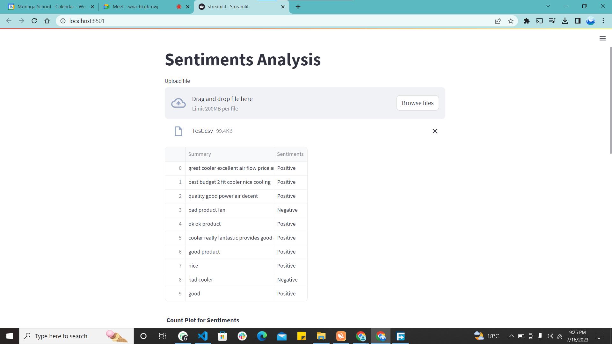

# Flipkart

## Table of Contents

- Business Understanding
- Problem Statement 
- Data Understanding
- Modelling
- Evaluation
- Conclusion
- Recommendation
- Installation
- Collaborators
- Repository Structure 

# Business understanding

Flipkart Private Limited is a prominent Indian e-commerce company headquartered in Bengaluru. In the highly competitive Indian e-commerce landscape, Flipkart's key rivals include Amazon India, Alibaba and domestic contender Snapdeal. As of March 2017, Flipkart secured a substantial 39.5% market share in the Indian e-commerce industry. Notably, the company has established a dominant presence in the apparel segment, thanks to its strategic acquisition of Myntra. Furthermore, Flipkart competes head-to-head with Amazon in the sale of electronics and mobile phones, signifying its strength in those areas.

# Problem Statement
The stakeholder for this project is Flipkart, a prominent Indian e-commerce company. Flipkart aims to leverage Natural Language Processing (NLP) techniques to enhance its business understanding and improve customer experiences.

The project focuses on utilizing NLP algorithms and methodologies to gain valuable insights from customer feedback, product reviews, and other textual data available on the Flipkart platform. By analyzing and extracting information from this data, Flipkart aims to gain a comprehensive understanding of customer preferences, sentiments, and needs.

# Data understanding
The Flipkart Dataset contains 189,874 rows and 5 columns. The column names include;

1. `ProductName` - Name of products
2. `Price` - the prices of the products(In Indian Rupees)
3. `Rate` - the customers' ratings out of 5
4. `Review` - short customer review of the products
5. `summary` - more detailed review of the products

# Modelling
We built 3 models, namely:
1. Naives Bayes
2. XGboost
3. Random Forest
# Evaluation
1. Naives Bayes had an accuracy on training set of 88.59% and an accuracy on test set of 86.88%.
2. XGboost had an accuracy on training set of 90.76% and an accuracy on test set of 90.5%.
3. Random Forest had an accuracy of 92.81% on the training set and 89.92% on the testing set.
# Findings
1. **Sentiment Analysis Accuracy:** The Gradient Boosting model achieved a high accuracy on both the training and test sets, indicating its effectiveness in predicting sentiment. 

2. **Feature Importance:** By utilizing the Gradient Boosting model, you can identify the key features or words that contribute significantly to the sentiment classification.

3. **Price Influence on Sentiment:** From the analysis, it was observed that the price of a product had little influence on its sentiment.

4. **Negative Sentiment Impact:** The analysis indicated that negative sentiment significantly affected the ratings given to products, irrespective of their price range.

5. **Text Preprocessing and Feature Engineering:** The use of text preprocessing techniques, such as lowercasing, removing punctuation, and tokenization, along with feature engineering, provided a refined representation of the textual data for sentiment analysis. 

6. **Potential for Improvement:** While the project has provided insights into sentiment analysis, there are always opportunities for further enhancement. This may involve exploring additional models, ensembling techniques, or refining the feature engineering process to extract more meaningful insights from the textual data.
# Recommendations
Flipkart can benefit from the following recommendations based on the sentiment analysis findings:

1. **Improve Product Curation:** Utilize the insights from sentiment analysis to identify the key features and aspects of products that receive positive sentiment.

2. **Enhance Customer Reviews and Ratings:** Encourage customers to provide detailed and honest reviews by implementing incentives or rewards.

3. **Offer Personalized Recommendations:** Leverage the sentiment analysis results to develop personalized product recommendations for individual customers.

4. **Address Negative Sentiments:** Pay close attention to products receiving negative sentiment and take immediate actions to address the underlying issues.

5. **Promote Positive Sentiment:** Capitalize on positive sentiment generated by satisfied customers to enhance Flipkart's brand reputation and attract new customers.

6. **Monitor Competitor Sentiment:** Extend the sentiment analysis to include competitor products and analyze customer sentiment towards them.

By implementing these recommendations, Flipkart can enhance its product offerings, improve customer satisfaction, strengthen its brand reputation, and maintain a competitive edge in the e-commerce industry.

# Limitations
The Naive Bayes model is not fit for prediction as there is possible overfitting given the disparity between accuracy of training and test sets.
The XGboost model is computationally expensive and can be time-consuming.
There is evidence of overfitting occuring in the Random Forest model, give the disparity between the the accuracy of the training and test set.
# Deployment
To run this project, follow these steps:
1. Clone the repository to your local machine using the following command:
    - git clone https://github.com/Leon380/Flipkart-Capstone-Project

2. Open your web browser and access the application at: https://flipkart-capstone-project-zudlnc7o57n.streamlit.app/
    This is the default URL where the application will be running. 

### Collaborators
The collaborators for this project were:

Pauline Ndungu

Maureen Anduuru 

Samuel Igecha

Leornard Rotich 

Henry Mativo

Samwel Muiru 

### Repository Structure: 

├── Data                                               

├── Model                                              

├── Template                                               

├── images 

├── streamlit      

├── README.md 

|── notebook.ipynb

├── requirements.txt                                             

|── streamlit.py                                   

├── vectorizer.pkl                                                   

├── xgboost.pkl   

Web app link: https://flipkart-capstone-project-zudlnc7o57n.streamlit.app/

## Project status
The current version of the project is finished and ready for use. Improvements will be made later.
